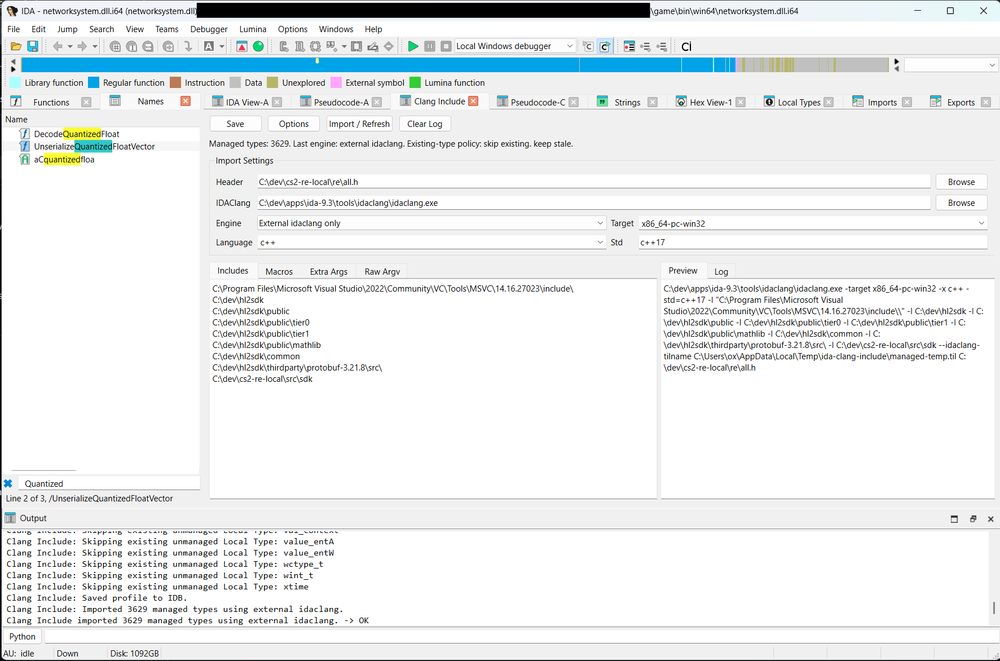
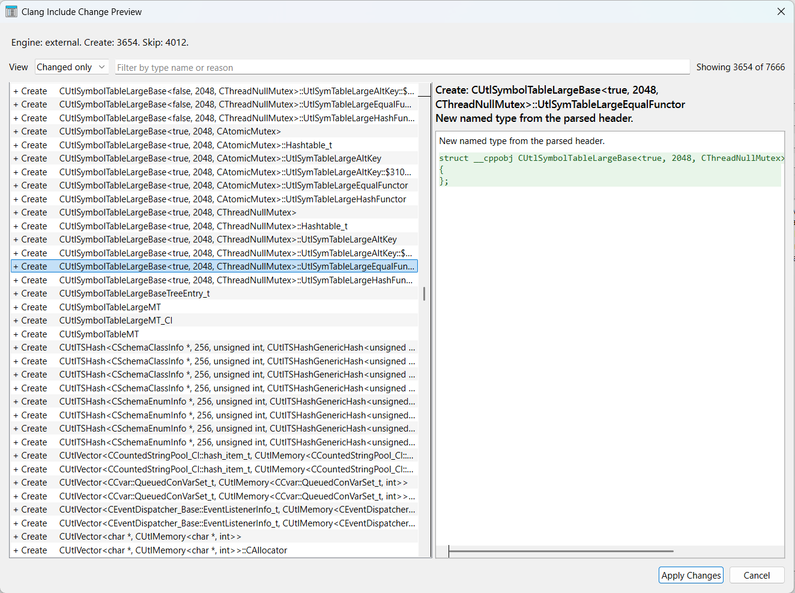

# IDAPro Clang Include

Clang Include is an IDA Pro plugin for importing C and C++ headers into Local Types with a clang-compatible argument model.

It is built for the common reverse-engineering workflow where you already have a useful umbrella header, but you do not want to keep rebuilding and reloading TILs just to iterate on types. The plugin keeps a per-IDB import profile, supports both IDA's parser API and external `idaclang.exe`, previews the exact Local Types changes before applying them, and refreshes previously managed types in place.

	

## Why not use built-in ida-clang dialog?

The built-in IDAClang dialog is nice, but not perfect. The UI is poor, and sometimes deals with types incorrectly. This plugin reiterates on the idea of using IDAClang to import C++/Other types into IDA, while providing nice and user-friendly UI and handy features, with a diff of what is about to be changed after the import.

It creates a nice diff of what is about to be changed after the import, and you can either discard or apply the changes:

	

## Features

- Dockable UI inside IDA under `Options -> Clang Include...`.
- Settings are saved inside the IDB, so you don't have to configure everything again.
- Two engine parsing modes: IDA parser API only, or external `idaclang` only.
- Dry-run change planning with a preview dialog before Local Types are modified.
- In-place refresh of plugin-managed types to reduce breakage across repeated imports.
- Conflict handling for pre-existing unmanaged Local Types: fail, skip, or adopt/update.
- Optional deletion of previously managed types that disappear from the latest parse result.
- Read-only resolved command preview, including raw argv override support when you need exact parser control.

## Installation

Copy the following into your IDA installation `plugins/` directory:

- `ida_clang_include.py`
- `clang_include/`

Then start IDA and open the plugin from `Options -> Clang Include...`.

## Quick Start

1. Open the IDB you want to work in and wait for auto-analysis to finish.
2. Open `Options -> Clang Include...`.
3. Set `Header` to the top-level header you want to import.
4. If you plan to use the external backend, confirm the `IDAClang` path points to a valid `idaclang.exe`.
5. Add any required include directories, macros, target triple, language, standard, and extra parser arguments.
6. Choose an engine mode:
	 - `Auto` tries one backend and falls back to the other if parsing fails.
	 - `IDA parser API only` keeps everything in-process.
	 - `External idaclang only` runs `idaclang.exe` directly.
7. Click `Import / Refresh`.
8. Review the change preview dialog and apply the plan if it looks correct.

## How Refresh Works

Each import runs in two stages:

- First, the plugin parses the configured header and **prepares a dry-run synchronization plan**. That plan is shown in a preview dialog with create, replace, delete, adopt, skip, and unchanged actions.
- Second, if you accept the preview, the plugin **applies the planned Local Types changes** and records the resulting managed type set in the current IDB. Later refreshes use that managed set to update only the types owned by the plugin.

## Engine Notes

Wondering what to use when? Read below.

### Auto

Auto mode uses the order configured in `Options`. You can prefer the in-process API first or prefer the external backend first.

### IDA Parser API

The API backend uses `ida_srclang` directly. It is the simplest path when IDA's built-in parser can handle the header set you care about. However, from experimenting with the tooling, the behaviour of the parsing differs from the external `idaclang` executable, and sometimes external executable is preferred, when IDA API doesn't want to parse your headers due to some compiler errors or triplet configuration.

### External `idaclang`

The external backend is useful when you need parser flags that only `idaclang` exposes. Advanced parser options and parser logging switches in the `Options` dialog apply to this backend, not to the API backend.