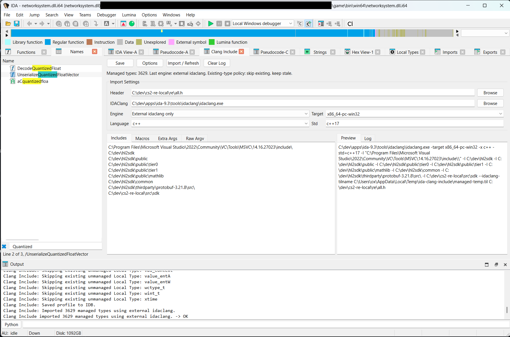
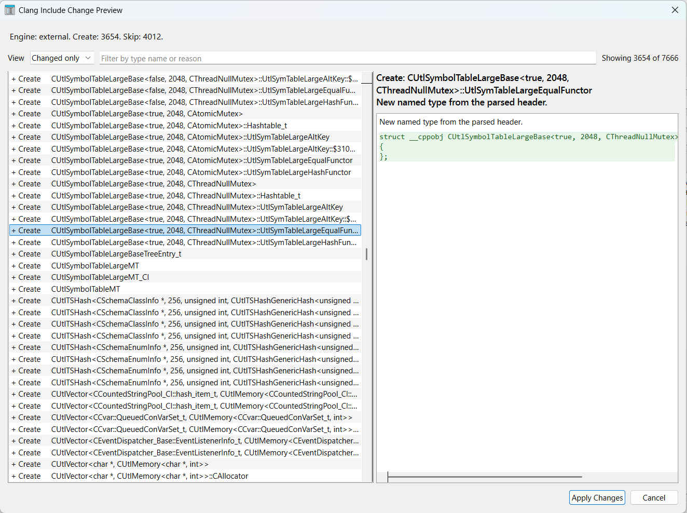
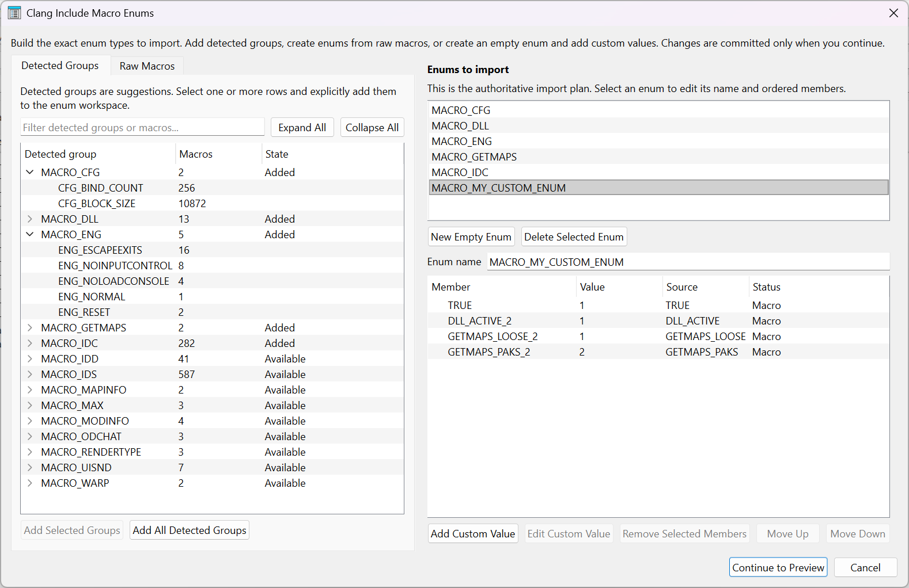

# IDAPro Clang Include

👉 Available on the [Hex-Rays Plugin Repository](https://plugins.hex-rays.com/oxikkk/ida-clang-include/clang-include).

Clang Include is an IDA Pro plugin for importing C and C++ headers into Local Types with a clang-compatible argument model.

<p align="center">
	
</p>


## Overview

IDA includes an IDAClang dialog, but larger or repeatedly imported header sets benefit from a workflow built around configuration, review, and safe refreshes. Clang Include provides a dockable interface for importing C and C++ types, preserving the import configuration in the IDB, and previewing every change before it is applied.

The main view keeps the parser configuration close at hand. Every import produces a change preview that can be reviewed or discarded before Local Types are modified.

<p align="center">
	
	
</p>

## Features

- Dockable UI inside IDA under `Options -> Clang Include...`.
- Settings are saved inside the IDB, so you don't have to configure everything again.
- Two engine parsing modes: IDA parser API only, or external `idaclang` only.
- Dry-run change planning with a preview dialog before Local Types are modified.
- In-place refresh of plugin-managed types to reduce breakage across repeated imports.
- Conflict handling for pre-existing unmanaged Local Types: fail, skip, or adopt/update.
- Optional deletion of previously managed types that disappear from the latest parse result.
- Read-only resolved command preview, including raw argv override support when you need exact parser control.
- Optional conversion of integer-valued macros into named enum types, with detected groups and fully custom enums.

## Installation

Preferred installation is via HCLI once the plugin is packaged and indexed by the IDA Plugin Manager:

```bash
hcli plugin install clang-include
```

If you have not installed HCLI yet, install it first and verify it is available:

```bash
hcli --version
```

If the plugin is not visible in the repository yet, or if you are testing local source changes, use the manual install path instead.

### Manual Install

Copy the following into your IDA installation `plugins/` directory:

- `ida_clang_include.py`
- `clang_include/`
- `ida-plugin.json`

Then start IDA and open the plugin from `Options -> Clang Include...`.

## Basic Usage

1. Open the IDB you want to work in and wait for auto-analysis to finish.
2. Open `Options -> Clang Include...`.
3. Set `Header` to the top-level header you want to import.
4. If you plan to use the external backend, confirm the `IDAClang` path points to a valid `idaclang.exe`.
5. Add any required include directories, macros, target triple, language, standard, and extra parser arguments.
6. Choose an engine mode:
   - `Auto` tries one backend and falls back to the other if parsing fails.
   - `IDA parser API only` keeps everything in-process.
   - `External idaclang only` runs `idaclang.exe` directly.
7. Click `Import / Refresh`.
8. Review the change preview and apply the plan if it looks correct.

Numeric macro import is optional and disabled by default. Enable it under `Options -> Macro Enum Conversion` when you want macros to become named enum types in IDA.

## Importing Macros as Enums

C preprocessor macros do not naturally appear as useful named types in IDA. Clang Include can discover integer-valued macros and turn the ones you choose into named enums in Local Types.

After macro discovery, the **Macro Enum Workspace** opens before the normal change preview. It is a staging area: only the enums shown on the right will be included in the import plan. You can start with automatically detected macro families or construct an enum from any combination of individual macros and custom values.

<p align="center">
	
</p>

### Workflow

1. Enable macro conversion under `Options -> Macro Enum Conversion` and choose a discovery engine:
   - `Python parsing` quickly scans project headers for simple integer literals.
   - `Clang` evaluates more complex integer expressions using a standalone `clang` executable.
2. Run `Import / Refresh` as usual.
3. In **Detected Groups**, add one or more suggested macro families—or use **Add All Detected Groups**.
4. In **Raw Macros**, select individual macros to create a new enum or add them to an existing one.
5. Review and edit the exact enum list on the right. You can rename enums, reorder or remove members, and add custom integer values.
6. Choose **Continue to Preview** to include those enums in the ordinary import diff.

<details>
<summary>Macro enum behavior and naming details</summary>

- Detected groups include both broad and specific underscore-prefix suggestions, such as `MACRO_IDC`, `MACRO_IDC_PLAYERINFO`, and `MACRO_IDC_VIDSELECT`.
- Broad and specific groups may overlap. Stable `_2`, `_3`, and later suffixes prevent IDA's global enum-member names from colliding.
- Added detected groups are saved as snapshots. Newly discovered matching macros remain available for review until the group is explicitly added again.
- Custom values accept conservative C integer literals, including decimal, hexadecimal, octal, binary, signs, and common integer suffixes.
- If a saved source macro disappears, its last discovered value remains in the enum and is marked as missing for review.

</details>

## How Refresh Works

Each import runs in two stages:

- First, the plugin parses the configured header and **prepares a dry-run synchronization plan**. That plan is shown in a preview dialog with create, replace, delete, adopt, skip, and unchanged actions.
- Second, if you accept the preview, the plugin **applies the planned Local Types changes** and records the resulting managed type set in the current IDB. Later refreshes use that managed set to update only the types owned by the plugin.

## Engine Notes

Wondering what to use when? Read below.

### Auto

Auto mode uses the order configured in `Options`. You can prefer the in-process API first or prefer the external backend first.

### IDA Parser API

The API backend uses `ida_srclang` directly. It is the simplest path when IDA's built-in parser can handle the header set you care about. However, from experimenting with the tooling, the behaviour of the parsing differs from the external `idaclang` executable, and sometimes external executable is preferred, when IDA API doesn't want to parse your headers due to some compiler errors or triplet configuration.

### External `idaclang`

The external backend is useful when you need parser flags that only `idaclang` exposes. Advanced parser options and parser logging switches in the `Options` dialog apply to this backend, not to the API backend.
